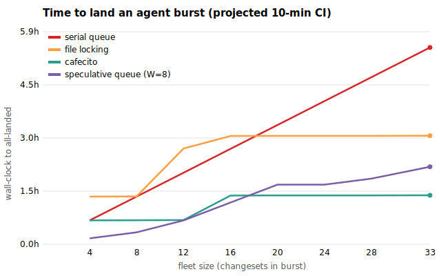
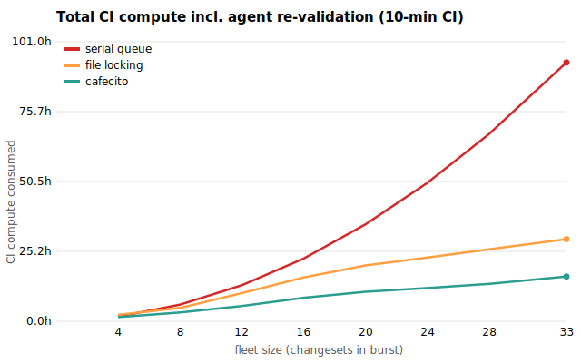

# MergeBench

Replays a **real agent fleet** through competing integration strategies and measures what
happens. One chart, three lines. See [../phase0/README.md](../phase0/README.md) for how the
fleet corpus was produced.

```sh
python3 mergebench.py [--ci-minutes 10]
```

## What is real vs. computed

Real, executed operations:
- the 33 changesets are a real uncoordinated fleet (33 agents, one base commit, sympy);
- per-changeset CI durations are measured pytest runs (`results/ci_measurements.json`);
- the conflict structure is measured (528 analyzed pairs, symbol write sets via the oracle);
- the cafecito landing actually happens: real `merge-tree` merges, **live regenerative merge**
  against accumulated main on every conflict, and a **real test gate on every landing —
  clean merges included**;
- the final landed main is materialized and its combined test union executed.

Computed, and labeled as such: queue *schedules*. Wall-clock and compute for each strategy
follow arithmetically from the landing schedule given per-changeset CI durations — shown for
the measured micro-CI (~1.3s) and a projected 10-minute full-suite CI.

## Results — 33-changeset burst, sympy @ 8960d6e8 (2026-07-06)

### The real landing (executed, not simulated)

| | |
|---|---|
| landed automatically | **30/33** (7 via live regeneration against accumulated main) |
| escalated to a human | 3 — and all three *should* escalate (below) |
| landing wall, real ops | 288.9s for the whole burst |
| **final main green** | **True** — the invariant is checked, never assumed |

The three escalations are the benchmark's best result:

1. `Add __repr__ to SympifyError` (duplicate assignment) — the two agents' tests assert
   **contradictory** exact repr formats; no merge can satisfy both. The landing gate refused
   it. This is a true conflict; the plane's job is to catch it, not to paper over it.
2. Two duplicate-task pairs whose regenerations didn't preserve a same-named test def —
   refused by the shadowing guard (acceptance tests must survive by name).

Earlier iterations of this benchmark landed red mains twice — once via conflict markers in an
uncovered file, once via an *ungated clean merge* flipping behavior under a landed test
(silent risk, live). Both failures are why the loop now gates **every** landing on a real test
run of the changeset's tests plus the impact tests of every touched file. The gate is not
optional equipment; the benchmark itself proved it.

### Schedules (33 changesets; projected 10-minute full-suite CI)

| strategy | integration stops | wall-clock | CI + re-validation compute |
|---|---|---|---|
| serial merge queue | 33 | 5.50 h | 93.5 h |
| file locking (Perforce-style) | 9 waves | 3.03 h | 29.7 h |
| **cafecito** (symbol oracle + regen) | **4 waves** | **1.37 h** | **16.2 h** |




Reading the curves (`results/mergebench_*.svg`, data in `results/mergebench.json`):

- **Serial queue wall grows linearly with fleet size** — throughput is capped at 1/CI-duration
  regardless of agent count. cafecito's wall steps only when the *conflict graph* forces a new
  wave; fleet size alone never moves it.
- **Baseline compute grows quadratically** (every landing re-validates every in-flight
  changeset); cafecito's grows near-linearly (memoized verification re-runs only on write-set
  intersection).
- File locking plateaus at ~2.2× cafecito's wall: 19–43% of same-file pairs commute at symbol
  level (phase0 data) and file locks serialize all of them needlessly.

## Honesty box

- The 10-minute CI is a projection; at the measured ~1.3s micro-CI the same schedule shapes
  compress to seconds (44s serial vs 140s cafecito) and cafecito's fixed regeneration cost
  dominates — the win grows with CI duration and fleet size, which is exactly the regime the
  product targets.
- The baseline is a classic serial queue (bors-style). Speculative queues (Aviator, GitHub)
  improve utilization when nothing conflicts but still serialize semantics and re-run CI on
  reorders; adding a speculative-queue baseline is future work.
- One repo, one fleet, hotspot-biased corpus (by design — see phase0). More repos and larger
  fleets are the next data milestone.
- Escalation policy is strict (by-name test survival; no retry loop for failed regens). A
  production reconciler would retry with more context before escalating.
